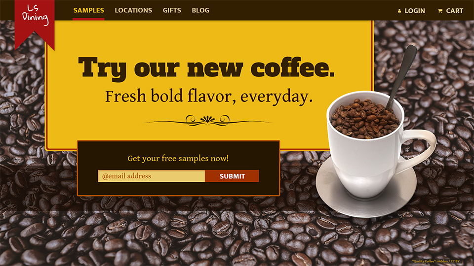

# Description

The Daily UI challenge is a great way to practice UI design. The prompts allow me to experiment creatively with solutions to a variety of simple design scenarios. 
I consider user experience as well as aesthetics to create compelling designs.

Want to see more? Follow me on my twitter
