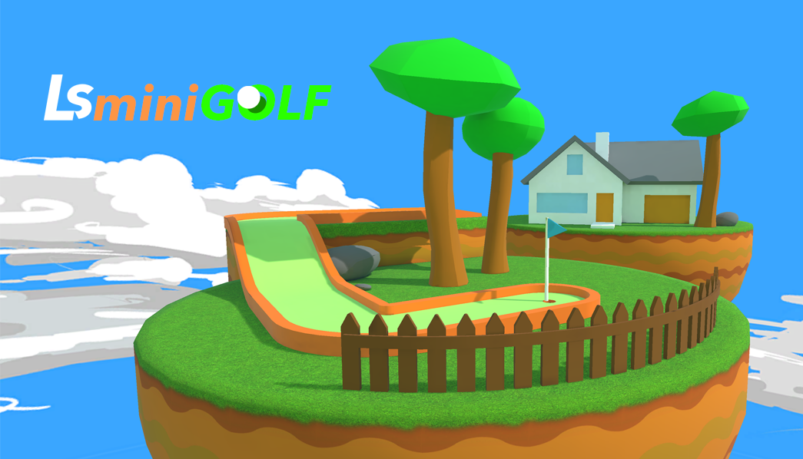

# Description

LsminiGOLF is a small mobile game I am working on in Unreal Engine 4. It started out as one of several experiments in Virtual Reality. I tried a few various simple, common games and tried to see which concepts were improved due to VR, and could utilize gaze control in an interesting way. It aims to be a straightfoward, fun minigolf game with a bright, colorful aesthetic for the [Samsung GearVR](https://www3.oculus.com/en-us/gear-vr/). Upcoming features in development include a variety of courses and controller support.

Download coming soon! Follow me on [twitter](https://twitter.com/ls_magic?lang=en) for more info.

