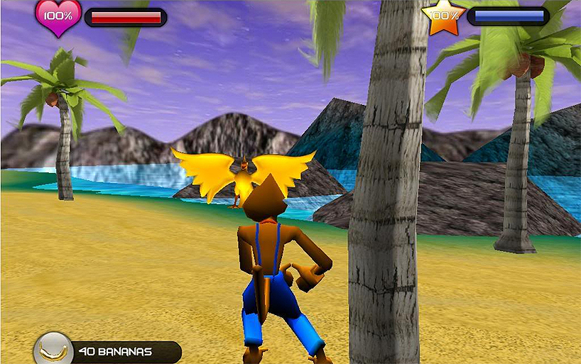
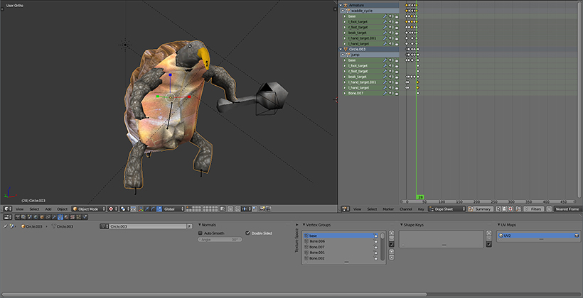
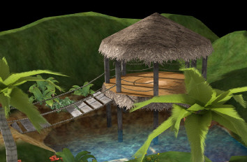
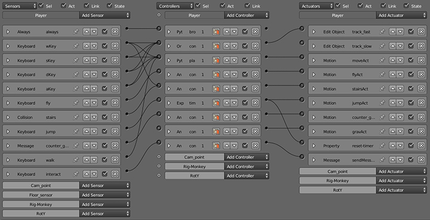
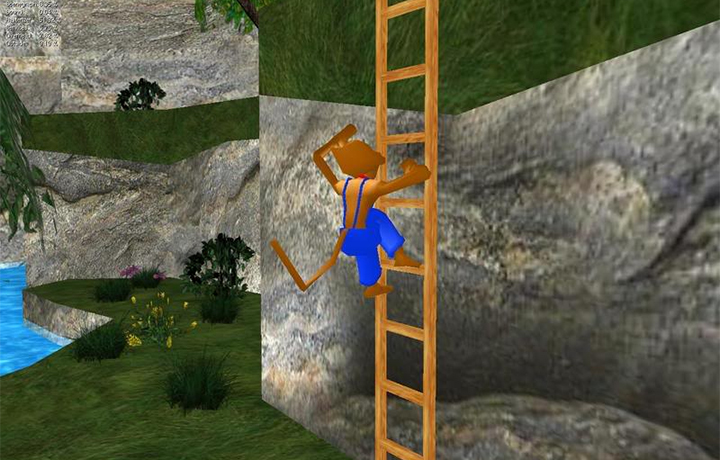
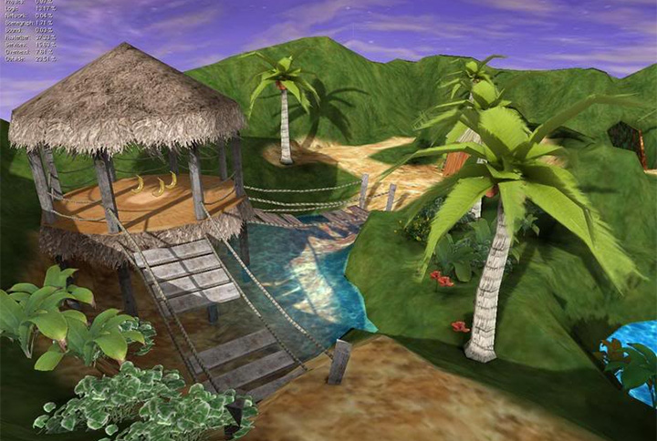
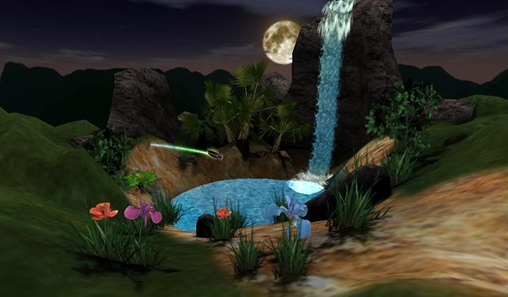

# Description

##THE GAME
The Monkey Game Project is an Open Source Blender game project featuring a monkey protagonist who must defeat various enemies and progress to the end of the level. The project was launched on blenderartists.org forums in 2007, with the goal of encouraging anybody interested in game development to dive into the process, regardless of skill level. The Monkey Game Project was featured in a 3-page ‘Making of’ feature article published in the 2008 issue of BlenderArt Magazine.

 

----

##DEVELOPMENT AND SETBACKS
Diving straight into development allowed us to quickly gain new skillsets in modeling, texturing, animation, and game logic .To help in organizing the development of the game, people who wanted to contribute were split into different teams to focus on various aspects of the project, such as environments, programming, characters, animations, and sound. The looseness and “dive right in” aspect of the process soon proved to be an issue however. Without a structured plan, development soon slowed to a crawl, with just a small team of members who were passionate about the project continuing to work on it.

 

----

##LEARNING FROM EXPERIENCE
Realizing that we would never reach a release without concrete goals, we decided to refocus ourselves with the goal of releasing a demo. Armed with new experience, we were more organized and more prepared for the realities of game design. We communicated better, set clear goals, launched a new website, and began to meet those goals.

 

----

##RELEASE
Thanks to our new focus, we were able to finish and release a demo in 2008. It consisted of multiple levels with a boss battle and multiple enemies. It also featured unused assets so that others could make use of them. MGP was released under a Creative Commons Attribution-Noncommercial 3.0 United States License.

