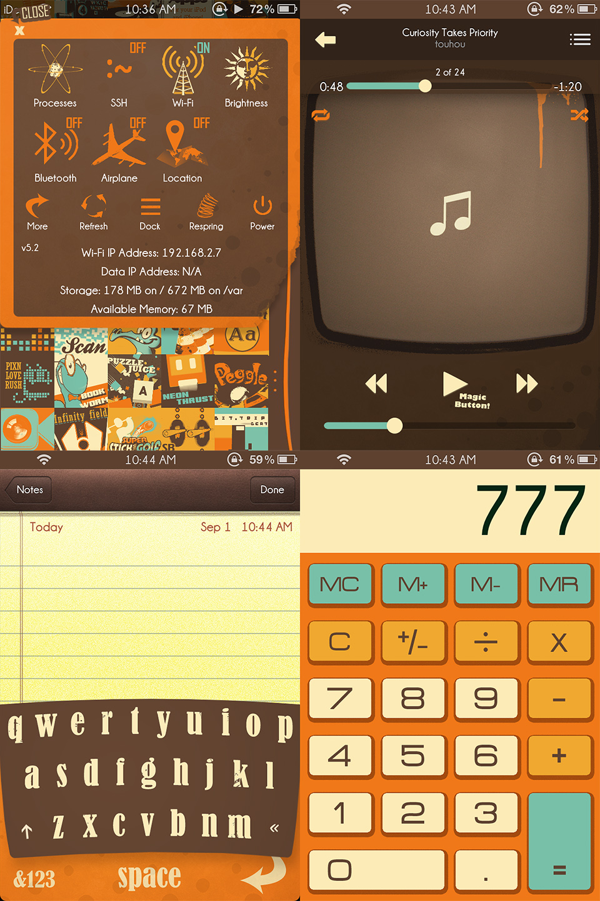

# Description

Vintage Typography is a cohesive icon set and Ui interface design replacement for iOS 5.0. I explored the use of a limited color palette to create a consistent theme. The consistent colors allowed me to experiment with a variety of text styles and images for the icons while still maintaining a cohesive style. I also styled the music player, keyboard, calculator, and toggle panel, creating an overall drastic departure from the original aesthetics.

